# A guide to installing Ubuntu 18.04 and getting up and runnuing with ROS:

There are two options:

1. [Install as a virtual machine](https://github.com/farbod1277/tutorials#first-option-vm-easier-but-limited-and-slower-to-run-at-times)
2. [Install as an OS alongside Windows](https://github.com/farbod1277/tutorials#second-option-dual-boot-a-bit-harder-to-do-depending-on-your-system-but-runs-much-better-and-is-not-limited-like-the-vm)

# First option: VM (easier but limited and slower to run at times):

1. Download Oracle VM VirtualBox from [here](https://www.virtualbox.org/wiki/Downloads).
2. Install it accordingly.
3. Once you've opened the program after installation create a new machine by clicking on New.

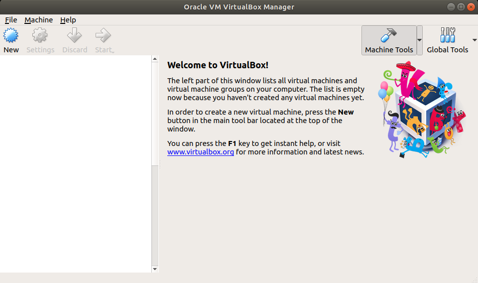

4. Choose Ubuntu for your virtual machine's OS.

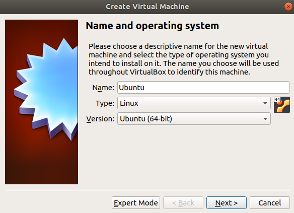

5. Allocate as much RAM possible (in the green area) for best performance of the VM.

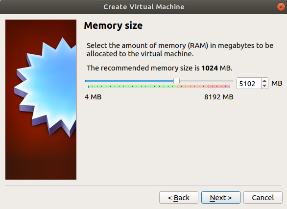

6. Create a virtual hard disk.

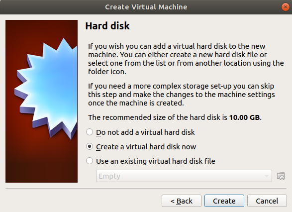

7. Choose VDI.

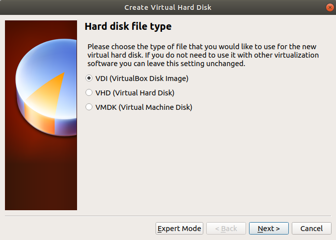

8. Choose Dynamically Allocated

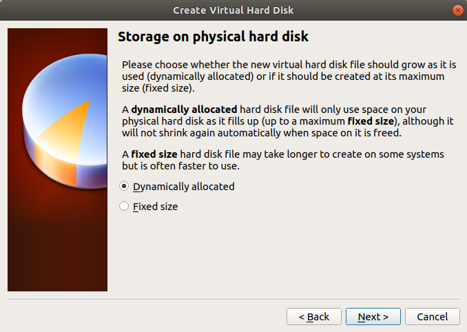

9. Choose the size as large as you can have on your system (30GB should be enough).

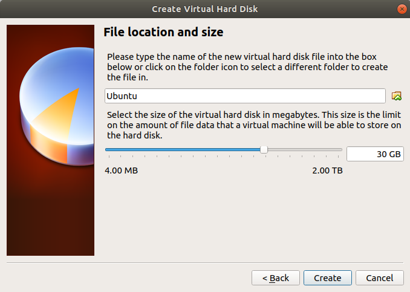

10. After creating the machine double click on it to start it.

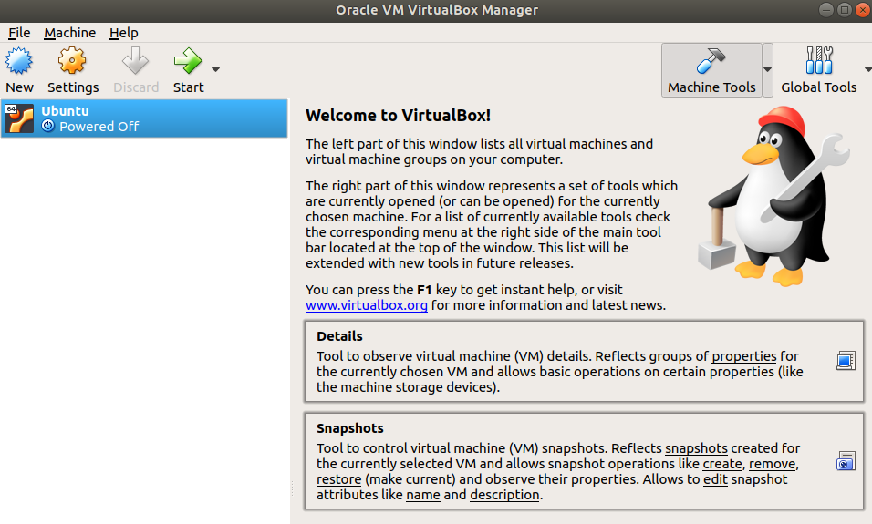

11. You need to download ubuntu 18.04 iso disk file from [here](http://releases.ubuntu.com/18.04.1/)

12. Select the file you just downloaded for the VM to boot from.

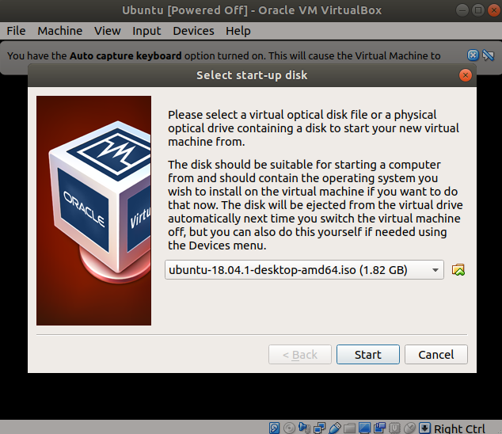

13. Instal Ubuntu.

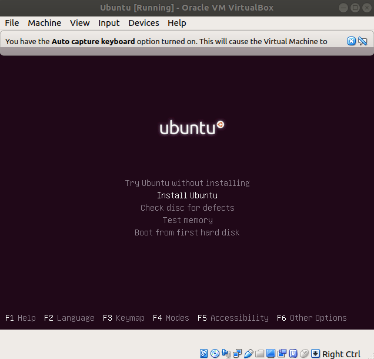

14. Select the options like so:

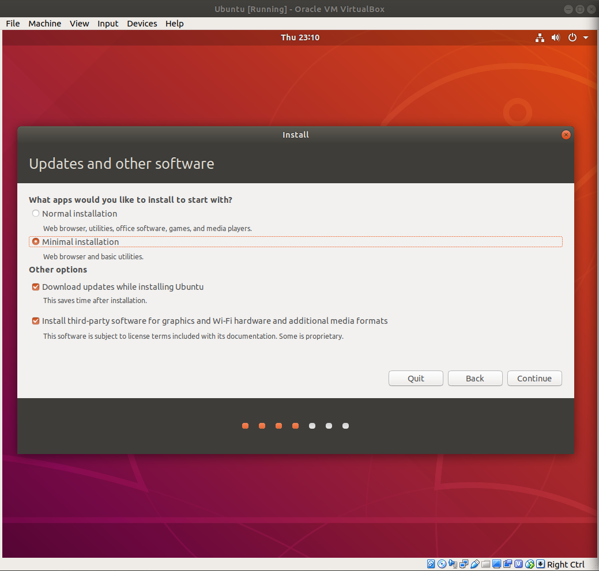

15. Continue with default selections until the installation is complete.

All done.

# Second option: Dual Boot (a bit harder to do depending on your system but runs much better and is not limited like the VM.)

Note that I've done this on a Surface Pro 2017 with Windows 10 installed, it might be a little different depending on your system.

1. Follow the instructions [here](https://www.reddit.com/r/SurfaceLinux/comments/7kb1ky/guide_installing_linux_on_surfaceseries_devices/) up to and including step 7 for surface devices and up to and including step 5 for non-surface devices.

Please be warned that this could cause loss of data and I can't be held accountable. Be careful and do your own research :)

# Installing ROS:

After you've got your Linux 18.04 up and running (either as a VM or as a dual boot), you can go ahead and familiarise yourself with it and start installing ROS:

1. Follow the instructions [here](http://wiki.ros.org/melodic/Installation/Ubuntu) for ROS Melodic.

2. After you've installed ROS, you may start doing the tutorials on ROS's website to get to know how it works and why it's useful.

Enjoy! :)

Signed: Farbod Torabi